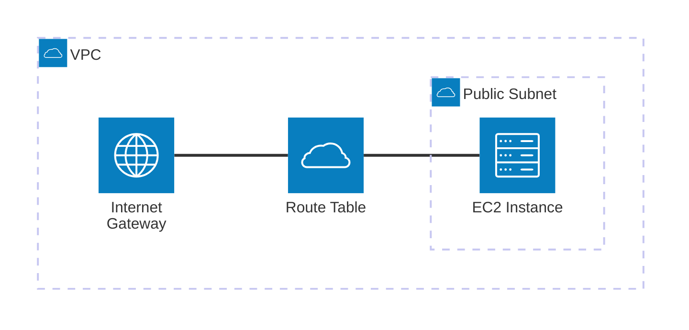

# AWS CloudFormationを試してみる

AWS CLIを使用してCloudFormationスタックを作成し、そのスタックに基づいて作成したEC2インスタンスにAWS Systems Manager (SSM) を通じて接続する

## 前提条件

- AWS CLIがインストールされ設定済みであること
- AWS CLIにSSMプラグインがインストールされていること

## 構成



### リソース

```bash
CloudFormation Stacks
├── Network Stack
│   ├── VPC
│   ├── Public Subnet
│   ├── Internet Gateway
│   ├── Route Table
│   ├── Route
│   ├── Subnet Route Table Association
│   └── Security Group
└── EC2 Stack
    ├── EC2 Instance
    └── Security Group (from Network Stack)
```

## 手順

### 1. IAMロールの作成

以下のコマンドを使用してIAMロールを作成します。

```bash
aws cloudformation create-stack --stack-name ec2-ssm-role-stack --template-body file://role/ec2-ssm-role.yml --capabilities CAPABILITY_IAM CAPABILITY_NAMED_IAM
```

以下のコマンドで`status`が `CREATE_COMPLETE`になることを確認します。

```bash
aws cloudformation describe-stacks --stack-name ec2-ssm-role-stack --query "Stacks[0].StackStatus" --output text
```

### 2. ネットワークの作成

ネットワークを作成するためのスタックを作成します。

```bash
aws cloudformation create-stack --stack-name ec2-ssm-network-stack --template-body file://network/ec2-network.yml --capabilities CAPABILITY_IAM CAPABILITY_NAMED_IAM
```

以下のコマンドで`status`が `CREATE_COMPLETE`になることを確認します。

```bash
aws cloudformation describe-stacks --stack-name ec2-ssm-network-stack --query "Stacks[0].StackStatus" --output text
```

### 3. EC2インスタンスの作成

EC2を作成するためのスタックを作成します。

```bash
aws cloudformation create-stack --stack-name ec2-ssm-stack --template-body file://ec2-ssm-stack.yml --capabilities CAPABILITY_IAM CAPABILITY_NAMED_IAM
```

以下のコマンドで`status`が `CREATE_COMPLETE`になることを確認します。

```bash
aws cloudformation describe-stacks --stack-name ec2-ssm-stack --query "Stacks[0].StackStatus" --output text
```

### 4. SSM接続の実行

#### EC2インスタンスIDの取得

作成したEC2インスタンスのIDを取得します。

```bash
INSTANCE_ID=$(aws cloudformation describe-stacks --stack-name ec2-ssm-stack --query "Stacks[0].Outputs[?OutputKey=='InstanceId'].OutputValue" --output text)
echo "EC2 Instance ID: $INSTANCE_ID"
```

```bash
# fishの場合
set INSTANCE_ID (aws cloudformation describe-stacks --stack-name ec2-ssm-stack --query "Stacks[0].Outputs[?OutputKey=='InstanceId'].OutputValue" --output text)
echo "EC2 Instance ID: $INSTANCE_ID"
```

#### SSM接続

SSMを使用してEC2インスタンスに接続します。

```bash
aws ssm start-session --target $INSTANCE_ID
```

## TIPS

### スタックの更新

```bash
aws cloudformation update-stack --stack-name ec2-ssm-stack --template-body file://ec2-ssm-stack.yml --capabilities CAPABILITY_IAM CAPABILITY_NAMED_IAM

aws cloudformation update-stack --stack-name ec2-ssm-role-stack --template-body file://role/ec2-ssm-role.yml --capabilities CAPABILITY_IAM CAPABILITY_NAMED_IAM

aws cloudformation update-stack --stack-name ec2-ssm-stack --template-body file://ec2-ssm-stack.yml --capabilities CAPABILITY_IAM CAPABILITY_NAMED_IAM
```

### スタックの削除

```bash
aws cloudformation delete-stack --stack-name ec2-ssm-stack
aws cloudformation delete-stack --stack-name ec2-ssm-network-stack
aws cloudformation delete-stack --stack-name ec2-ssm-role-stack
```
